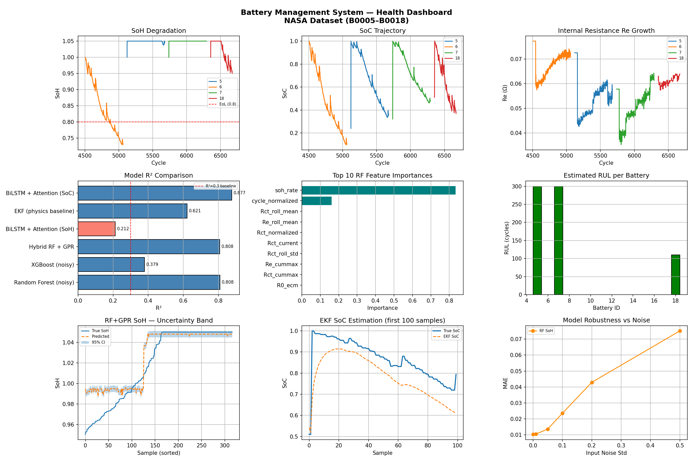
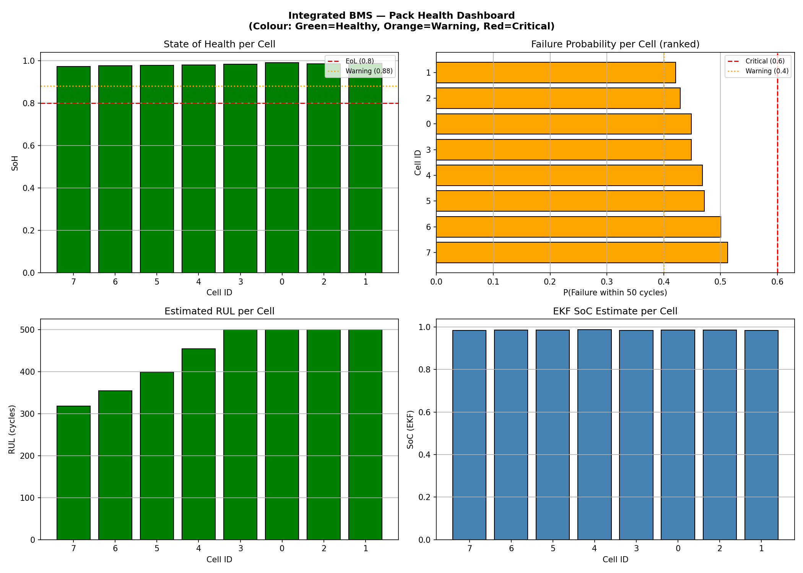
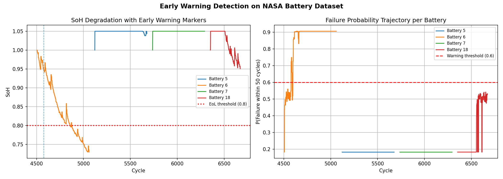
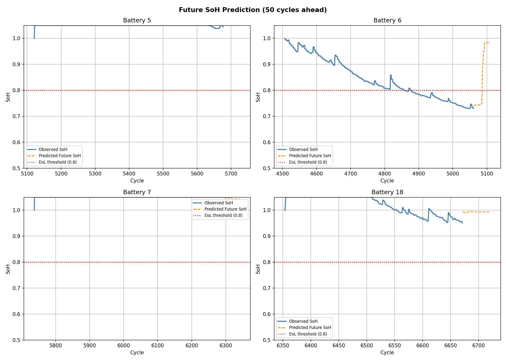
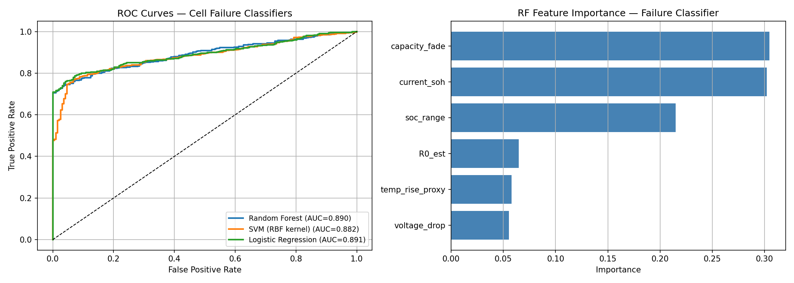
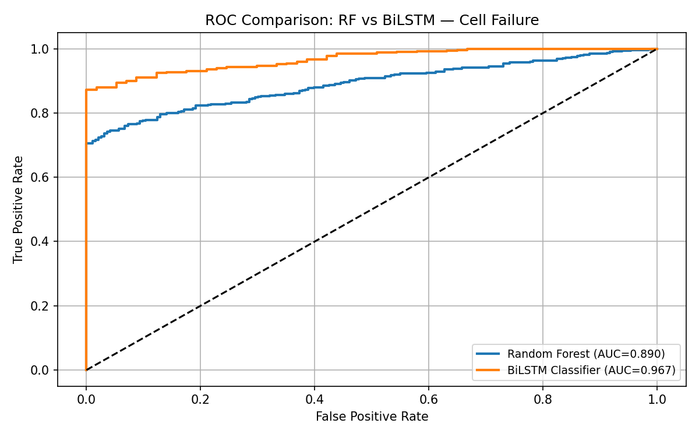

# 🔋 AI-Powered Battery Management System Simulator

> **Machine Learning Assisted Battery Management System (BMS) with State of Health (SoH) Estimation, State of Charge (SoC) Tracking, Cell Failure Prediction, and 282-Cycle Early Warning using the NASA Li-ion Battery Dataset.**


---

# 📌 Overview

This project presents an **AI-powered Battery Management System (BMS)** developed for lithium-ion batteries using the **NASA Battery Degradation Dataset**.

The simulator combines **physics-based battery modeling** with **machine learning** to estimate battery health, predict failures, and generate comprehensive battery diagnostics.

### Major Capabilities

- 🔋 State of Health (SoH) Estimation
- ⚡ State of Charge (SoC) Estimation
- 🚨 Cell Failure Prediction
- 📈 Remaining Useful Life Prediction
- 📊 Battery Health Dashboard
- 🔬 8-Cell Battery Pack Simulation
- 📉 Early Failure Warning System

---

# 🏆 Key Achievement

> **Detected battery degradation 282 cycles before actual End-of-Life (EOL) on NASA Battery B0006.**

---

# 📊 Performance Summary

| Task | Best Model | Performance |
|------|------------|------------|
| SoH Estimation | Random Forest + Gaussian Process Regression | **R² = 0.808** |
| SoC Estimation | BiLSTM + Attention | **R² = 0.877** |
| Cell Failure Prediction | BiLSTM + Attention | **ROC-AUC = 0.967** |
| Physics Baseline | Extended Kalman Filter | **R² = 0.621** |

---

# 📷 Results

## 🔋 Battery Health Dashboard



---

## 🔋 Pack Health Dashboard



---

## 🚨 Early Failure Warning



---

## 📈 Future SoH Prediction



---

## 📊 Classifier ROC Curve



---

## 📉 Random Forest vs BiLSTM ROC Comparison



---

# ✨ Features

- Machine Learning Assisted Battery Management
- State of Health Prediction
- State of Charge Estimation
- Cell Failure Prediction
- Remaining Useful Life Prediction
- Battery Health Report Generation
- Hybrid Physics + Machine Learning Framework
- Extended Kalman Filter Implementation
- Gaussian Process Regression
- Attention-based Deep Learning
- Manufacturing Variation Simulation
- Synthetic Battery Degradation
- Noise Injection for Robustness
- Confidence Interval Estimation

---

# 🧠 Project Workflow

```text
NASA Battery Dataset
        │
        ▼
Data Cleaning & Preprocessing
        │
        ▼
Feature Engineering
(19 Engineered Features)
        │
        ▼
Battery-wise Train/Test Split
        │
        ├──────────────┐
        │              │
        ▼              ▼
SoH Models        SoC Models
RF/XGB/LSTM       EKF/LSTM
        │              │
        └──────┬───────┘
               ▼
8-Cell Battery Pack Simulator
               ▼
Cell Failure Prediction
               ▼
Battery Health Report
               ▼
282-Cycle Early Warning
```

---

# 🤖 Machine Learning Models

## State of Health (SoH)

- Random Forest
- XGBoost
- Random Forest + Gaussian Process Regression
- BiLSTM + Attention

---

## State of Charge (SoC)

- Extended Kalman Filter
- BiLSTM + Attention

---

## Cell Failure Prediction

- Random Forest
- Support Vector Machine
- Logistic Regression
- BiLSTM + Attention

---

# 📈 Classification Performance

| Model | Accuracy | F1 Score | ROC-AUC |
|--------|----------|----------|---------|
| Random Forest | 82.6% | 0.892 | 0.890 |
| SVM | 82.0% | 0.887 | 0.882 |
| Logistic Regression | 81.6% | 0.886 | 0.891 |
| **BiLSTM + Attention** | **95.9%** | **0.979** | **0.967** |

---

# ⚙ Technical Highlights

- Battery-wise train/test split (Prevents data leakage)
- Physics-informed battery features
- Equivalent Circuit Model (ECM)
- Extended Kalman Filter
- Gaussian Process Regression
- Deep Learning with BiLSTM + Attention
- Manufacturing variation modelling (±5%)
- Synthetic degradation simulation
- Gaussian noise injection
- Confidence interval estimation

---

# 📂 Repository Structure

```text
AI-Powered-BMS-Simulator
│
├── bms_models/
│   ├── *.pkl
│   ├── *.pt
│   └── Model Files
│
├── bms_outputs/
│   ├── plots/
│   │   ├── battery_health_dashboard.png
│   │   ├── pack_health_dashboard.png
│   │   ├── early_warning.png
│   │   ├── future_soh_prediction.png
│   │   ├── classifier_roc.png
│   │   ├── roc_rf_vs_bilstm.png
│   │   └── ...
│   │
│   ├── model_comparison.csv
│   ├── classifier_comparison.csv
│   └── pack_health_report.csv
│
├── BMS_Simulator_NASA.ipynb
├── requirements.txt
├── README.md
└── LICENSE
```

---

# 📦 Installation

Clone the repository

```bash
git clone https://github.com/mridul1236/AI-Powered-BMS-Simulator.git
```

Move into the project

```bash
cd AI-Powered-BMS-Simulator
```

Install dependencies

```bash
pip install -r requirements.txt
```

Launch Jupyter Notebook

```bash
jupyter notebook
```

Open

```
BMS_Simulator_NASA.ipynb
```

Run all cells sequentially.

---

# 📁 Dataset

**NASA Li-ion Battery Degradation Dataset**

Batteries Used

- B0005
- B0006
- B0007
- B0018

Rows after preprocessing

```
1984
```

Synthetic battery samples generated

```
10,000+
```

---

# 🛠 Technology Stack

- Python
- PyTorch
- Scikit-Learn
- XGBoost
- NumPy
- Pandas
- Matplotlib
- Joblib
- Jupyter Notebook

---

# 📊 Generated Outputs

The simulator automatically generates

- Battery Health Dashboard
- Pack Health Dashboard
- Early Warning Report
- Future SoH Prediction
- ROC Curves
- Confusion Matrix
- Model Comparison Report
- Classifier Comparison Report
- Battery Pack Health Report

---

# 🎯 Applications

- Electric Vehicles (EVs)
- Battery Management Systems
- Battery Digital Twins
- Predictive Maintenance
- Battery Analytics
- Smart Battery Packs
- Energy Storage Systems
- Embedded Battery Monitoring

---

# 📚 References

1. NASA Ames Prognostics Center Battery Dataset
2. G. L. Plett, "Extended Kalman Filtering for Battery Management Systems"
3. Hu et al., "Equivalent Circuit Models for Lithium-Ion Batteries"
4. Zhao et al., "Review of Battery State-of-Health Estimation"
5. Park et al., "LSTM-Based Remaining Useful Life Prediction"

---

# 👨‍💻 Author

**Mridul Mahajan**

Electronics & Communication Engineering

Thapar Institute of Engineering and Technology

### Areas of Interest

- Battery Management Systems
- Electric Vehicles
- Machine Learning
- Embedded Systems
- Digital Electronics

---

# ⭐ Support

If you found this repository useful,

⭐ **Please consider giving it a star.**

It helps the project reach more developers and researchers.

---

# 📜 License

This project is licensed under the **MIT License**.
